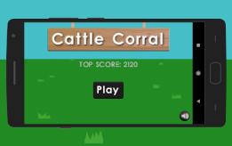
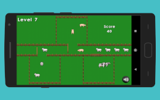
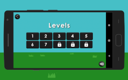

<a href='https://play.google.com/store/apps/details?id=com.creativesource.cattlecorral&pcampaignid=MKT-Other-global-all-co-prtnr-py-PartBadge-Mar2515-1'></a>

**Cattle Corral is a simple to learn, arcade style game, that will put your multi-tasking & reflex skills to the ultimate test. With 10 levels of increasing difficulty, you'll always have a challenge ahead!**

**Cows, pigs, and sheep are on their way back to the farm, and it's your job to keep them separate from one another as they all head in at once. Be careful though, the animals will start to move faster through the corrals as you complete each level.** 

**So get ready... get set, and prepare for a stampede of fun!**



## Built Using

* [LibGDX](https://libgdx.badlogicgames.com/) - Cross-platform game development framework
* [Tiled](https://www.mapeditor.org/) - Map Editor
* [Shade UI](https://github.com/czyzby/gdx-skins/tree/master/shade) - Custom LibGDX Skin
* [OpenGameArt](https://opengameart.org/) - Game Resource Community

## License

```
All Rights Reserved
```
